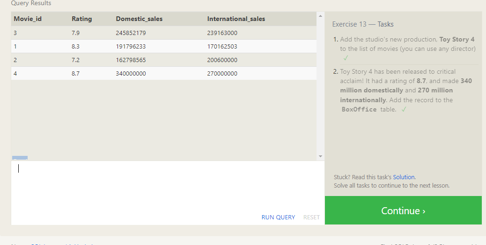

# Reading Notes

## About
##### This site is a bridge to guide you to become a software developer step by step, and you will learn all about software development like designing, programming, documenting, testing, and bug fixing involved in creating and maintaining applications, frameworks, or other software components, through these following courses :

- ### Code 102 - **[Intro to Software Development](https://www.codefellows.org/courses/code-102/intro-to-software-development)**
> Not sure where or how to start learning software development? Or maybe you’re discouraged by the confusing interfaces, unclear error messages, and unexplained concepts of         online coding tutorials,Make sure this course for you .

- ### Code 201 - **[Foundations of Software Development](https://www.codefellows.org/courses/code-201/foundations-of-software-development)**
> This course guides students toward developing a well-rounded foundation of skills necessary for modern web development. These skills include HTML, CSS, and JavaScript coding; utilizing Git workflow processes, project organization, designing with wireframing and employing introductory Agile development methods.

- ### Code 301 - **[Intermediate Software Development](https://www.codefellows.org/courses/code-301/intermediate-software-development)**
> In this intensive course, you will study the common core of software development, including the MVC pattern, object-oriented and functional programming, and computer science fundamentals such as basic data structures and algorithms. Come learn how to create and deploy web apps in the “MERN” stack with Mongo, Express, React, and Node.js, with the help of third-party APIs and libraries from around the web.

- ### Code 401 - **[Advanced Software Development](https://www.codefellows.org/courses/code-401/advanced-software-development-in-full-stack-javascript)**
> Build full-stack web applications with server-side Node.js and modern, client-side, front-end libraries and frameworks, including React. Throughout this intensive course, you will study data structures and algorithms, professional software development techniques, and established industry best practices as you advance your skills in full-stack JavaScript.

---
# SQL Course

## Introduction to SQL
- SQL is a database computer language designed for the retrieval and management of data in a relational database. SQL stands for Structured Query Language
- In this course you are going to learn all SQL command to help you to fetch your data as you will .


## SQL Lesson 1: SELECT queries 101
- SELECT is command to retrieve data from a SQL database EX:

```sql
SELECT * 
FROM mytable;
```


## SQL Lesson 2: Queries with constraints (PT. 1) 
- We need to use WHERE in this siction its for return data by specific condition EX:

```sql
SELECT column, another_column, …
FROM mytable
WHERE condition
    AND/OR another_condition
    AND/OR …;
```
- And there's many Operator we can use like (AND , OR , BETWEEN , NOT BETWEEN , IN , NOT IN) .
- And numerical operators like (=, !=, < <=, >, >=) .


## SQL Lesson 3: Queries with constraints (Pt. 2)
- WHERE clases can comparing strings EX :

```sql
SELECT column, another_column, …
FROM mytable
WHERE condition
    AND/OR col_name = "abc"
    AND/OR col_name LIKE "ABC"
    AND/OR col_name IN ("A", "B", "C");
```
> note that : All string between quotation is case sensitive


## SQL Lesson 4: Filtering and sorting Query results
- DISTINCT : return data whitout duplicate 
```sql
SELECT DISTINCT column, another_column, …
FROM mytable
WHERE condition(s);
```
- ORDER BY : To sort your results by a given column 

```sql
SELECT column, another_column, …
FROM mytable
WHERE condition(s)
ORDER BY column ASC/DESC;
```

- LIMIT and OFFSET clauses, LIMIT to return number rows ,OFFSET where it begin

```sql
SELECT column, another_column, …
FROM mytable
WHERE condition(s)
ORDER BY column ASC/DESC
LIMIT num_limit OFFSET num_offset;
```


## SQL Review: Simple SELECT Queries
- You can return specific column name from table

```sql
SELECT column, another_column, …
FROM mytable
```


## SQL Lesson 6: Multi-table queries with JOINs
- Using the JOIN clause in a query, we can combine row data across two separate tables using this unique key. The first of the joins that we will introduce is the INNER JOIN.\

```sql 
SELECT column, another_table_column, …
FROM mytable
INNER JOIN another_table 
    ON mytable.id = another_table.id
WHERE condition(s)
ORDER BY column, … ASC/DESC
LIMIT num_limit OFFSET num_offset;
```
> note that : some example write JOIN even INNER JOIN is same .


## SQL Lesson 7: OUTER JOINs
- We using OUTER JOINs /LEFT /RIGTH/FULL If the two tables have asymmetric data.

```sql
SELECT column, another_column, …
FROM mytable
INNER/LEFT/RIGHT/FULL JOIN another_table 
    ON mytable.id = another_table.matching_id
WHERE condition(s)
```
> note that : some example write LEFT JOIN, RIGHT JOIN, and FULL JOIN even LEFT OUTER JOIN, RIGHT OUTER JOIN, or FULL OUTER JOIN is same .


## SQL Lesson 8: A short note on NULLs
- Some time we need NULL value to check if there NULL data in our table

```sql
SELECT column, another_column, …
FROM mytable
WHERE column IS/IS NOT NULL
```
> note that : it's also not possible to avoid NULL values .


## SQL Lesson 9: Queries with expressions
- In sql we can but all data query returned in virtual column using AS keyword

```sql
SELECT col_expression AS expr_description, …
FROM mytable;
```


## SQL Lesson 10: Queries with aggregates (Pt. 1)
> SQL have buldin function can help you Ex :
- COUNT(*)
- COUNT(column)
- MIN(column)
- MAX(column) 
- AVG(column) 
- SUM(column)

```sql 
SELECT AVG(column_or_expression)
FROM mytable
WHERE constraint_expression
```


## SQL Lesson 11: Queries with aggregates (Pt. 2)
- HAVING clause which is used specifically with the GROUP BY clause to allow us to filter grouped rows from the result set.

```sql 
SELECT group_by_column, AGG_FUNC(column_expression) AS aggregate_result_alias, …
FROM mytable
WHERE condition
GROUP BY column
HAVING group_condition;
```


## SQL Lesson 12: Order of execution of a Query
### Query order of execution
1. FROM and JOINs
The FROM clause, To specify what table need you need to join with .
2. WHERE
To return data with condition . 
3. GROUP BY
It class to return data by spacify condition . 
4. HAVING
If the query has a GROUP BY clause.
5. SELECT
Any expressions in the SELECT to return what rows you need . 
6. DISTINCT
Of the remaining rows, rows with duplicate values .
7. ORDER BY
It class to sort data by spacify column name .
8. LIMIT / OFFSET
LIMIT and OFFSET clauses, LIMIT to return number rows ,OFFSET where it begin


## SQL Lesson 13: Inserting rows
- When inserting data into a database, Need to use INSERT keyword Ex:

```sql
INSERT INTO mytable
VALUES (value_or_expr, another_value_or_expr, …);
```




## SQL Lesson 14: Updating rows
- common task is to update existing data, which can be done using an UPDATE statement Ex:

```sql
UPDATE mytable
SET column = value_or_expr, 
```


## SQL Lesson 15: Deleting rows
- When you need to delete data from a table in the database, you can use a DELETE statement Ex:

```sql
DELETE FROM mytable
WHERE condition;
```


## SQL Lesson 16: Creating tables
- You can create a new database table using the CREATE TABLE statement Ex:

```sql
CREATE TABLE table_name (
    column1 datatype,
    column2 datatype,
    column3 datatype,
   ....
);
```


## SQL Lesson 17: Altering tables
- Using the ALTER TABLE statement to add, remove, or modify columns and table constraints Ex:

```sql
ALTER TABLE mytable
ADD column DataType OptionalTableConstraint 
    DEFAULT default_value;
```


## SQL Lesson 18: Dropping tables
- To remove an entire table including all of its data you can use the DROP TABLE statement Ex:

```sql
DROP TABLE table_name;
```

OR if table exists use :

```sql 
DROP TABLE IF EXISTS mytable;
```


readingnote@mail.com Contact us for more details :email:
