# SQL Course

## Introduction to SQL
- SQL is a database computer language designed for the retrieval and management of data in a relational database. SQL stands for Structured Query Language
- In this course you are going to learn all SQL command to help you to fetch your data as you will .


## SQL Lesson 1: SELECT queries 101
- SELECT is command to retrieve data from a SQL database EX:

```sql
SELECT * 
FROM mytable;
```


## SQL Lesson 2: Queries with constraints (PT. 1) 
- We need to use WHERE in this siction its for return data by specific condition EX:

```sql
SELECT column, another_column, …
FROM mytable
WHERE condition
    AND/OR another_condition
    AND/OR …;
```
- And there's many Operator we can use like (AND , OR , BETWEEN , NOT BETWEEN , IN , NOT IN) .
- And numerical operators like (=, !=, < <=, >, >=) .

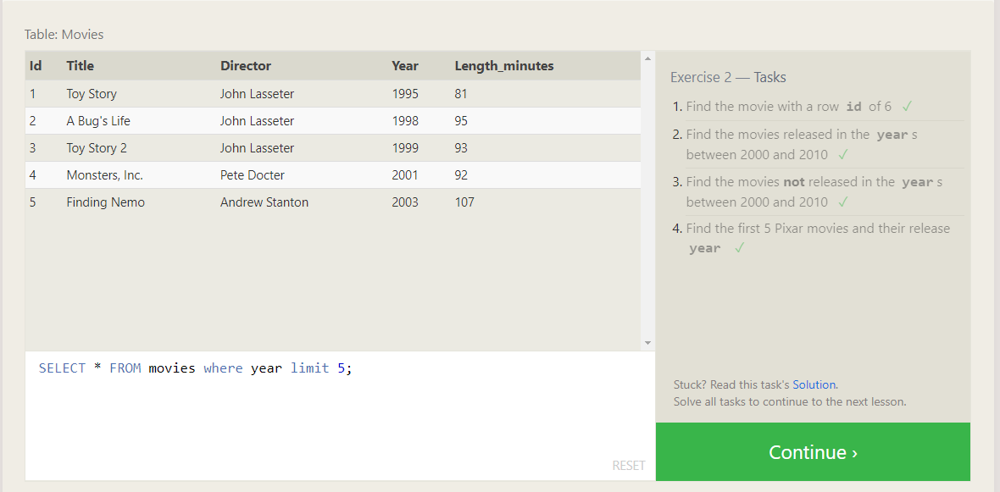

## SQL Lesson 3: Queries with constraints (Pt. 2)
- WHERE clases can comparing strings EX :

```sql
SELECT column, another_column, …
FROM mytable
WHERE condition
    AND/OR col_name = "abc"
    AND/OR col_name LIKE "ABC"
    AND/OR col_name IN ("A", "B", "C");
```
> note that : All string between quotation is case sensitive

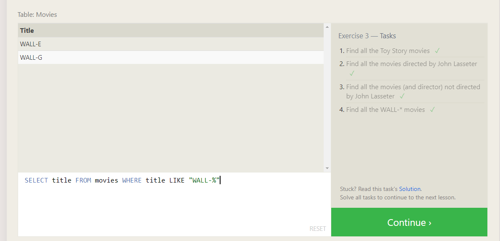

## SQL Lesson 4: Filtering and sorting Query results
- DISTINCT : return data whitout duplicate 
```sql
SELECT DISTINCT column, another_column, …
FROM mytable
WHERE condition(s);
```
- ORDER BY : To sort your results by a given column 

```sql
SELECT column, another_column, …
FROM mytable
WHERE condition(s)
ORDER BY column ASC/DESC;
```

- LIMIT and OFFSET clauses, LIMIT to return number rows ,OFFSET where it begin

```sql
SELECT column, another_column, …
FROM mytable
WHERE condition(s)
ORDER BY column ASC/DESC
LIMIT num_limit OFFSET num_offset;
```

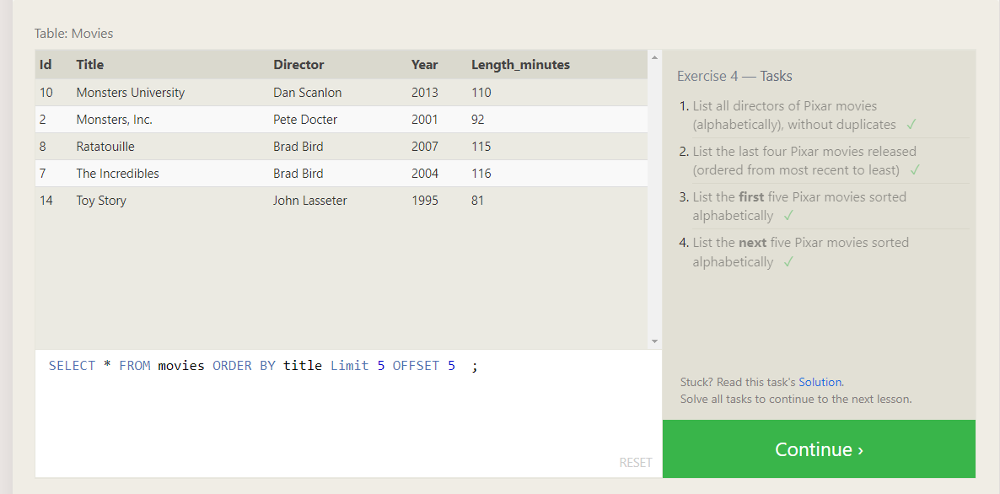


## SQL Review: Simple SELECT Queries
- You can return specific column name from table

```sql
SELECT column, another_column, …
FROM mytable
```
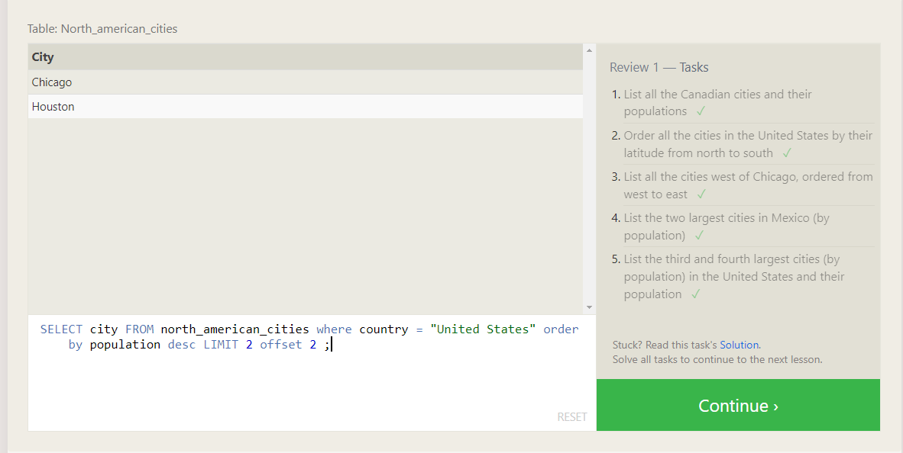

## SQL Lesson 6: Multi-table queries with JOINs
- Using the JOIN clause in a query, we can combine row data across two separate tables using this unique key. The first of the joins that we will introduce is the INNER JOIN.\

```sql 
SELECT column, another_table_column, …
FROM mytable
INNER JOIN another_table 
    ON mytable.id = another_table.id
WHERE condition(s)
ORDER BY column, … ASC/DESC
LIMIT num_limit OFFSET num_offset;
```
> note that : some example write JOIN even INNER JOIN is same .

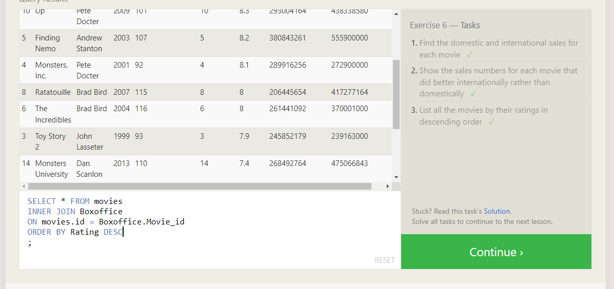

## SQL Lesson 7: OUTER JOINs
- We using OUTER JOINs /LEFT /RIGTH/FULL If the two tables have asymmetric data.

```sql
SELECT column, another_column, …
FROM mytable
INNER/LEFT/RIGHT/FULL JOIN another_table 
    ON mytable.id = another_table.matching_id
WHERE condition(s)
```
> note that : some example write LEFT JOIN, RIGHT JOIN, and FULL JOIN even LEFT OUTER JOIN, RIGHT OUTER JOIN, or FULL OUTER JOIN is same .

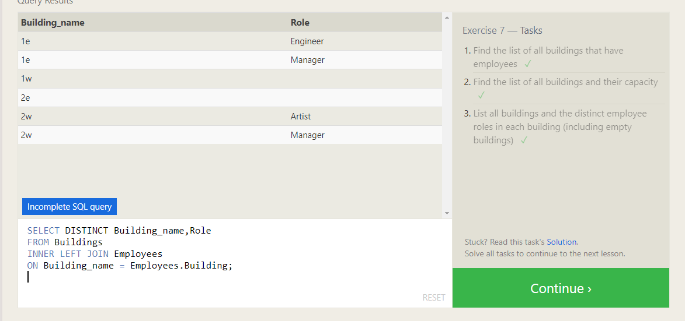

## SQL Lesson 8: A short note on NULLs
- Some time we need NULL value to check if there NULL data in our table

```sql
SELECT column, another_column, …
FROM mytable
WHERE column IS/IS NOT NULL
```
> note that : it's also not possible to avoid NULL values .

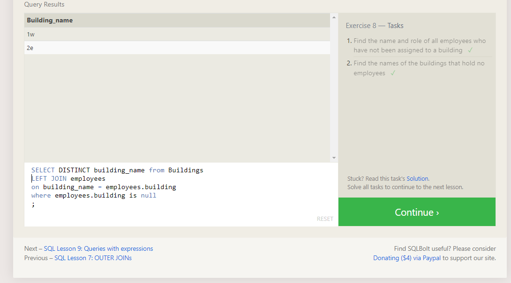

## SQL Lesson 9: Queries with expressions
- In sql we can but all data query returned in virtual column using AS keyword

```sql
SELECT col_expression AS expr_description, …
FROM mytable;
```

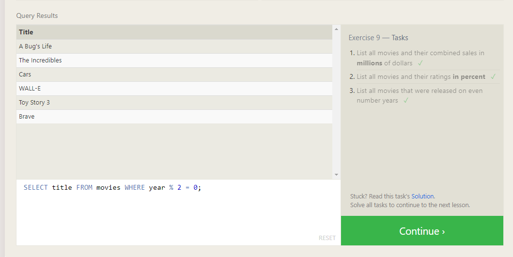

## SQL Lesson 10: Queries with aggregates (Pt. 1)
> SQL have buldin function can help you Ex :
- COUNT(*)
- COUNT(column)
- MIN(column)
- MAX(column) 
- AVG(column) 
- SUM(column)

```sql 
SELECT AVG(column_or_expression)
FROM mytable
WHERE constraint_expression
```

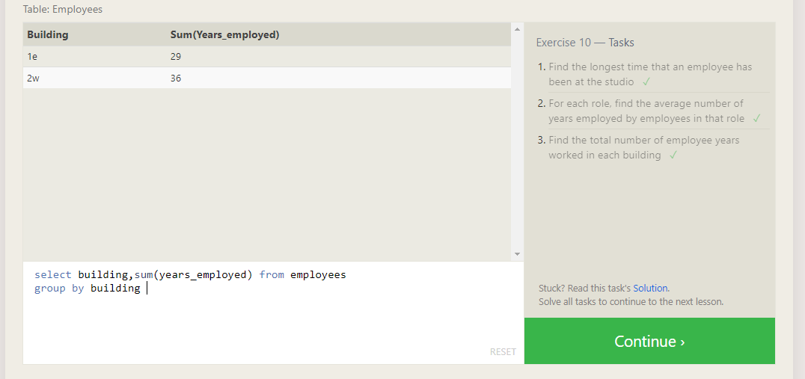

## SQL Lesson 11: Queries with aggregates (Pt. 2)
- HAVING clause which is used specifically with the GROUP BY clause to allow us to filter grouped rows from the result set.

```sql 
SELECT group_by_column, AGG_FUNC(column_expression) AS aggregate_result_alias, …
FROM mytable
WHERE condition
GROUP BY column
HAVING group_condition;
```

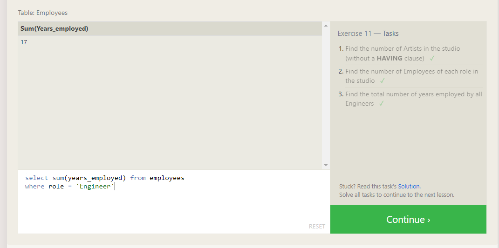

## SQL Lesson 12: Order of execution of a Query
### Query order of execution
1. FROM and JOINs
The FROM clause, To specify what table need you need to join with .
2. WHERE
To return data with condition . 
3. GROUP BY
It class to return data by spacify condition . 
4. HAVING
If the query has a GROUP BY clause.
5. SELECT
Any expressions in the SELECT to return what rows you need . 
6. DISTINCT
Of the remaining rows, rows with duplicate values .
7. ORDER BY
It class to sort data by spacify column name .
8. LIMIT / OFFSET
LIMIT and OFFSET clauses, LIMIT to return number rows ,OFFSET where it begin


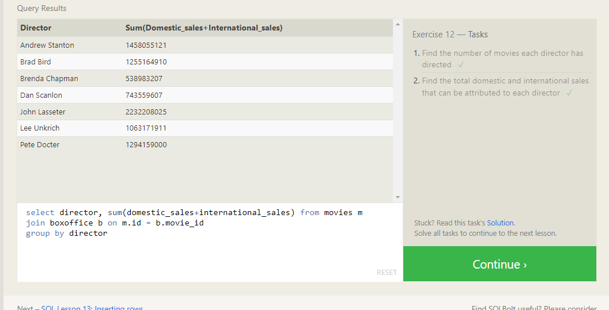

## SQL Lesson 13: Inserting rows
- When inserting data into a database, Need to use INSERT keyword Ex:

```sql
INSERT INTO mytable
VALUES (value_or_expr, another_value_or_expr, …);
```

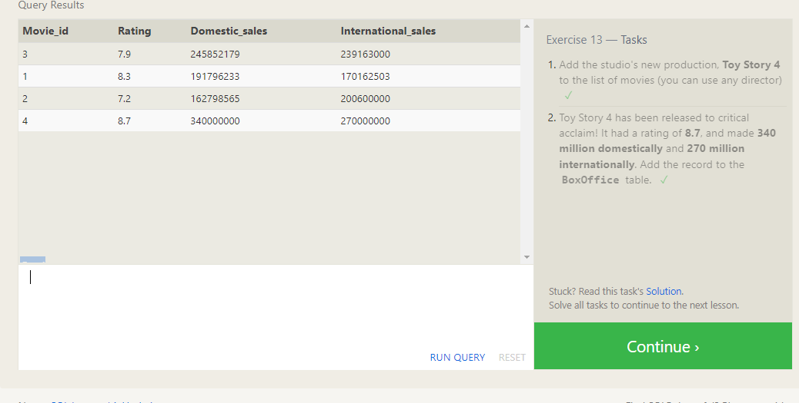


## SQL Lesson 14: Updating rows
- common task is to update existing data, which can be done using an UPDATE statement Ex:

```sql
UPDATE mytable
SET column = value_or_expr, 
```

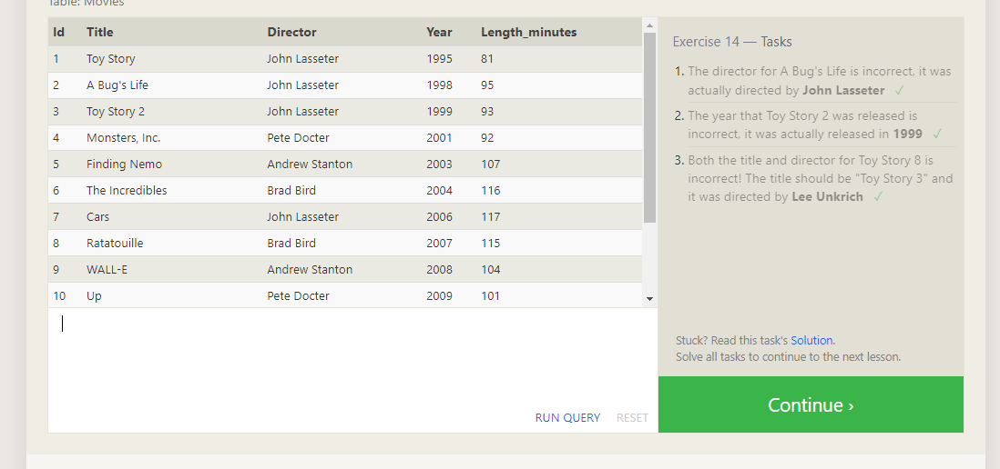

## SQL Lesson 15: Deleting rows
- When you need to delete data from a table in the database, you can use a DELETE statement Ex:

```sql
DELETE FROM mytable
WHERE condition;
```

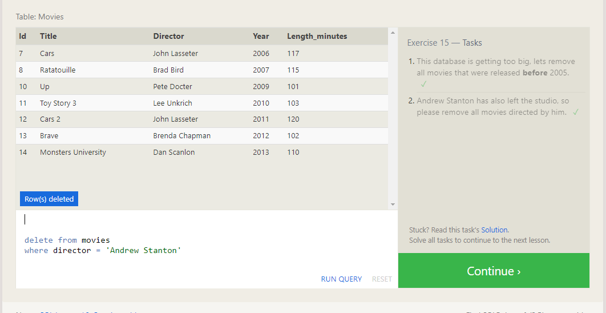

## SQL Lesson 16: Creating tables
- You can create a new database table using the CREATE TABLE statement Ex:

```sql
CREATE TABLE table_name (
    column1 datatype,
    column2 datatype,
    column3 datatype,
   ....
);
```

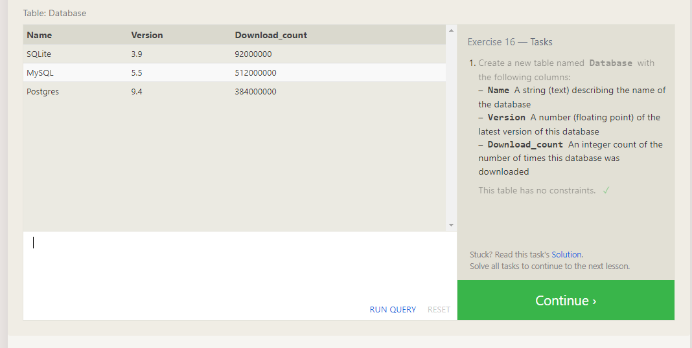

## SQL Lesson 17: Altering tables
- Using the ALTER TABLE statement to add, remove, or modify columns and table constraints Ex:

```sql
ALTER TABLE mytable
ADD column DataType OptionalTableConstraint 
    DEFAULT default_value;
```

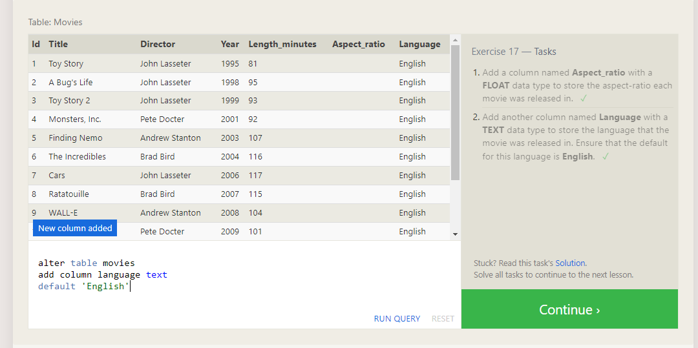

## SQL Lesson 18: Dropping tables
- To remove an entire table including all of its data you can use the DROP TABLE statement Ex:

```sql
DROP TABLE table_name;
```

OR if table exists use :

```sql 
DROP TABLE IF EXISTS mytable;
```

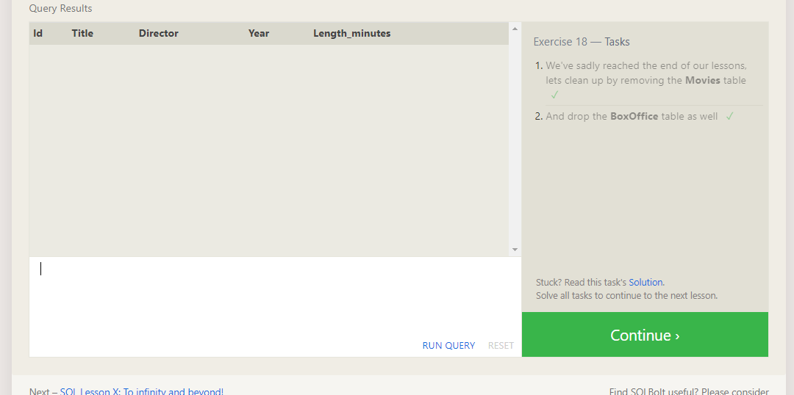

------